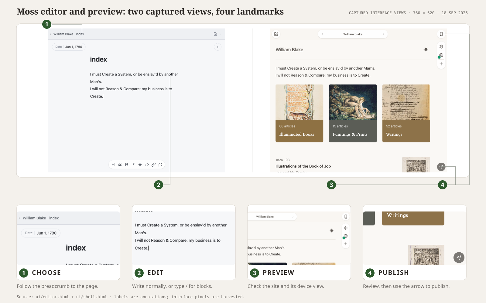

青苔把文件、正在书写的页面与完成后的网站放在同一个窗口里。你一边写，右侧预览一边更新。拖动分割线可以调整空间；也可以关闭其中一边，专心做一件事。

*编辑器与预览由真实界面截图组合而成。1. 沿文件路径选择页面。2. 编辑页面，或输入 `/` 插入模块。3. 检查实时预览与设备视图。4. 确认后，点击箭头发布。*

## 直接写作

选中文字后会出现小工具栏，不用记住 Markdown，也可以设定标题、强调、链接等常用格式。

在新的一行输入 `/`，可以打开插入菜单，加入标题、列表、媒体与青苔排版。如果你熟悉 Markdown，照常输入即可：源文件依然是普通的 `.md` 文件，也能用 Obsidian 或任何文本编辑器打开。

## 在文件夹中整理网站

文件树就是网站的结构。你可以创建、重命名文件与文件夹，也可以从 Finder 拖入素材。把图片、视频、音频、PDF、notebook 或整个文件夹拖入文件树，就会复制到网站中；拖进正文，则会插入到正在书写的位置。

重命名文件或文件夹时，青苔会同步更新指向它的链接。删除被其他页面引用的文件前，青苔会列出哪些链接将会失效。

## 与预览一起工作

点击预览中的页面，可以打开对应源文件；点击编辑器中的图片或其他嵌入文件，可以在预览中找到它。预览使用与发布网站相同的主题和页面结构，也支持明暗模式。

键盘操作见英文 [Editor shortcuts](/docs/writing/editor/)。要了解源文件写法，请继续阅读[[使用 Markdown 写作]]。
