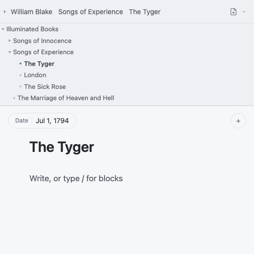
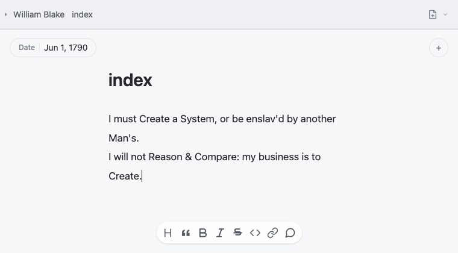

編輯器上方是網站資料夾，下方是正在書寫的頁面。頂部路徑既是麵包屑，也是緊湊的檔案樹；再往下依次是頁面屬性、標題、Markdown 內文與寫作工具。

## 尋找與建立頁面

點擊麵包屑中的資料夾，可以展開其中的檔案與子資料夾；點擊頁面即可開啟。要在目前頁面旁邊新增內容，請右鍵點擊資料夾或檔案樹空白處，再選擇**新增頁面**或**新增資料夾**。

拖曳檔案樹下邊框，可以顯示更多或更少的檔案。雙擊邊框會收合檔案樹；再次雙擊即可展開。

資料夾結構也是網站結構。新資料夾會成為欄目，Markdown 檔案會成為頁面。檔案如何對應網址，詳見[網站結構](/docs/writing/structure/)。

## 從範本開始

要儲存頁面供日後重複使用，請右鍵點擊它的 Markdown 檔案，選擇**儲存為範本…**，再輸入名稱。要儲存整個資料夾結構，請對資料夾的首頁檔案執行同一操作；青苔會把它標記為資料夾範本。

要使用範本，請開啟新增頁面按鈕旁的**新增選項**選單，再從**從範本**一欄選擇範本。頁面範本會建立新頁面；資料夾範本會建立包含已儲存內容的新資料夾。同一選單中的**管理範本…**可以重新命名或刪除範本。

## 設定頁面屬性

頁面上方的標籤是 frontmatter 屬性，包括標題、日期、封面、可見性，以及其他影響頁面本身或頁面在網站中位置的設定。點擊標籤可以編輯，點擊 **+** 可以新增屬性。青苔會把結果儲存為 Markdown 檔案頂部的 YAML frontmatter。

大標題預設取自檔名，因此編輯它會重新命名檔案，並更新指向它的 wikilink。只有公開標題需要與檔名不同時，才新增 `title` 屬性；新增後，編輯大標題會改動該屬性。完整欄位見[[用 Frontmatter 定義頁面|頁面屬性與 frontmatter]]。

## 寫作

在主編輯區直接寫普通 Markdown。選取文字會出現浮動格式工具列；在行首輸入 `/` 會開啟插入選單；也可以使用底部工具列。來源檔始終是普通的 `.md` 檔案；[[使用 Markdown 寫作|Markdown 指南]]介紹標題、列表、連結等基礎寫法。

青苔的版面與元件使用 `:::` 圍欄。可以從 `/` 選單插入，也可以直接輸入；範例見[[用短代碼排版及插入特殊功能|短代碼]]。

把本機檔案從 Finder 拖進編輯區，青苔會複製並插入它。圖片、音訊、影片、PDF、notebook、HTML 等支援的媒體也能用 wikilink 連結或嵌入。輸入 `[[` 可搜尋整個網站；`[[頁面]]` 建立連結；前面加 `!`，例如 `![[image.jpg]]`，則會嵌入內容。完整語法與檔案類型見[[引用檔案與媒體|連結與媒體]]。

## 儲存與恢復版本

右鍵點擊頁面、資料夾或網站根目錄，再選擇**版本…**。版本範圍取決於你點擊的項目。每次發佈時，青苔都會儲存一個版本；也可以選擇**儲存一個版本**，立即儲存並視需要命名。開啟已儲存的版本，可以查看此後有哪些變更，也可以恢復這個頁面、資料夾或整個網站。恢復前，青苔會先儲存目前狀態，因此可以復原。

鍵盤操作見英文 [Editor shortcuts](/docs/writing/editor/)。頁面完成後，在即時預覽中檢查效果，再從預覽窗格發佈。
